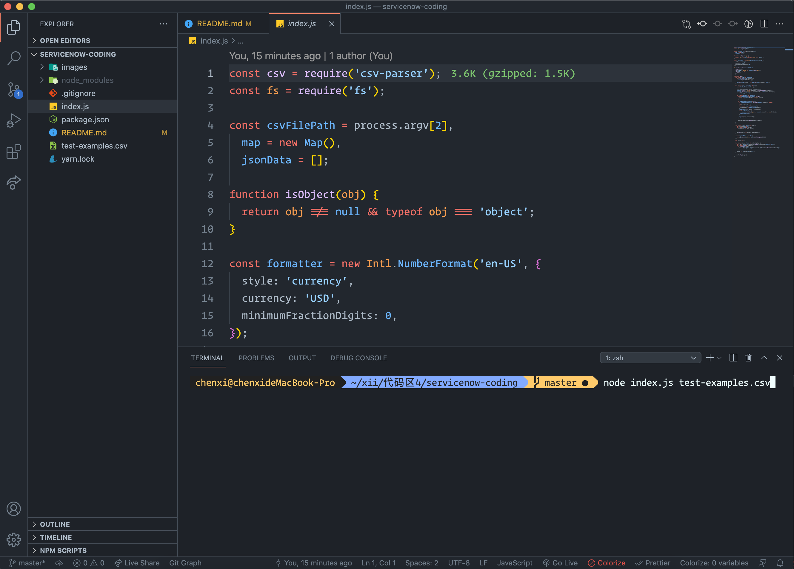
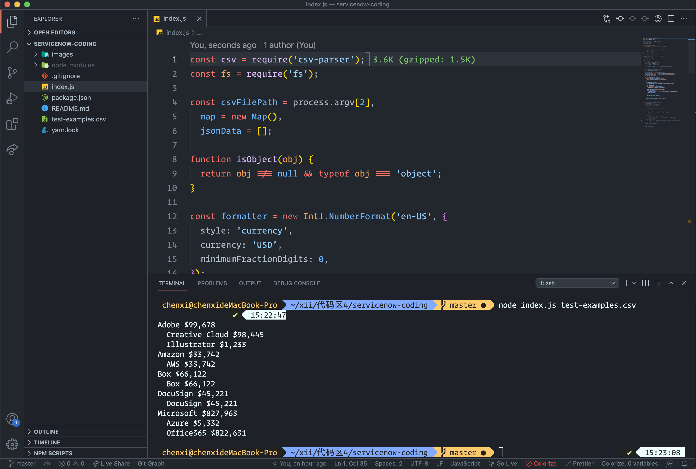

# Console App

### Here is the web version: ...

### Run on your machine

### 1. Environment

- JavaScript
- Node.js: **Please install Node in your machine**. (Recommend **LTS** version)

### 2. How to run code

#### 2.1 Install Yarn (If you use npm, skip this step)

- Install `yarn`: `npm install --global yarn`

#### 2.2 Open this project in your code editor and then open terminal

- Make sure you are in the **root directory** of this project

- Install dependencies: Run `npm install` or `yarn install`

#### 2.3 Type `node index.js ./test-examples.csv` in the terminal

#### 2.4 (Optional)

- There is a test-examples.csv file in the root directory. If you want to test other CSV files, just put the file in the root directory and run the command `node index.js ./YOUR_CSV_FILE_NAME.csv`

### 3. Packages

- csv-parser

### 4. Preview

